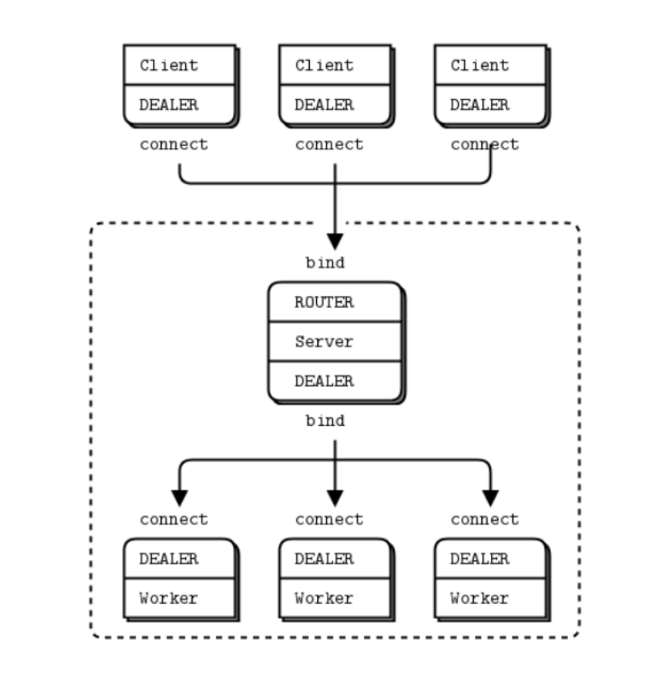
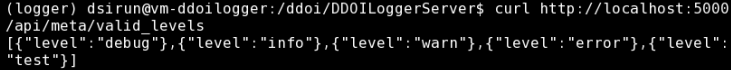
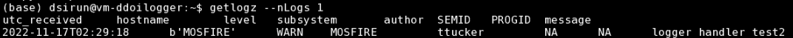
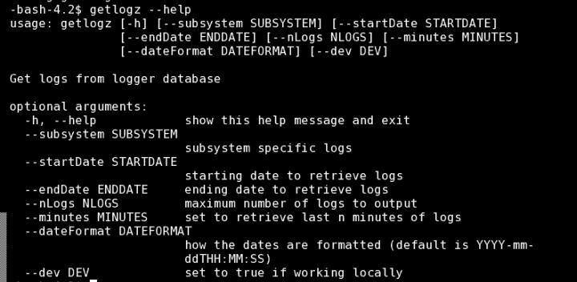

Logger Server and Client Deployment
===================================

Installing Logger Server
------------------------

The Logger server handles requests from logging instances throughout the Keck Network. 
The logger includes all observing players (SA, OA, Observer, and SW). This server stores and displays logs using a 
Mongo database, an HTTP flask server, and a ZMQ server.::

- The MongoDB stores records.

- The HTTP flask server is used to access the logs over HTTP. 
  The HTTP server should be used for administrative tasks, 
  such as setting additional levels and subsystems. 

.. figure:: _static/http-logger-arch.png
   :width: 600

   High-level architectural view of HTTP logger. 
   Client sends a request and the server handles the request. 
   When finished the server sends an acknowledgment.

- The ZMQ server acts as the main logger. Handling requests from multiple clients much faster than the HTTP server.

  High-level view of ZMQ logger architecture. 
  Multiple clients log to the server, which passes tasks to workers asynchronously.

An example use case has the logger keep track of the DDOI execution engine as it ingests and processes OBs 
throughout the night. Users will be able to read and understand the state of the execution engine via the logs. 

The source code is located in the GitHub repository. The most up-to-date version is located on the zmq branch. 
The software design document describing form, function, and requirements is found here.

Server
^^^^^^

The server vm-ddoilogger's ip address is 10.95.1.94 and runs using:

**dsibld** - clones GIT repository, build directories, runs systemctl commands. 
Note that systemctl runs scripts as root. DSI bld also handles the python environment
in /usr/local/anaconda3/bin/python3, installs libraries, etc.

**Assumptions: This document assumes that you have MongoDB and conda/pip (Python 3) installed on the 
machine that is running ZMQ.**

Database Deployment
-------------------

Transfer the :download:`attached files <_static/logger_db.zip>` with ``mongorestore``.

Build Procedure
---------------

Python Environment Setup
^^^^^^^^^^^^^^^^^^^^^^^^

The server depends on the configuration file found in the repo. Use the zmq branch. 
This describes the host address, port number, and the number of workers. 

1. Clone the server to the directory /ddoi

2. Using the dsirun account, set the python VE to loggerwith the command conda activate logger. If the logger does env does not exist, the command conda create --name logger python=3.9 creates the environment.

3. The server is deployed by first installing the libraries described in the requirements.txt file with the following pip command.

.. code-block::  console 

  sudo /usr/local/anaconda/bin/pip -e requirements.txt

Deployment
----------

Simply running the command python zmq_server.py starts the server. To run it as a daemon, use the Linux process manager Systemd.
 Scripts are run as daemons and restarted should they unexpectedly exit. Systemd configuration files are stored in /etc/systemd/system/zmq_logger.service, 
 shown below. Using the dsibld account create the file below.

.. code-block::  console 

    [Unit]
    Description=ZMQ Logger Server
    After=multi-user.target

    [Service]
    Type=simple
    Restart=always
    ExecStart=/usr/local/anaconda/bin/python3 /ddoi/DDOILoggerServer/default/zmq_server.py
    [Install]
    WantedBy=multi-user.target

You can start, stop, and check the status of the daemon with the command `sudo systemctl start/stop/status zmq_logger`
 Note how the service uses a Conda environment to run a python instance.

Run the HTTP server by running the http_logger.service file shown below. Run it with `sudo systemctl http_logger start`. 

.. code-block::  console 

    [Unit]
    Description=HTTP Logger Server
    After=multi-user.target

    [Service]
    Type=simple
    Restart=always
    ExecStart=/usr/local/anaconda/bin/python3 /ddoi/DDOILoggerServer/default/http_server.py

    [Install]
    WantedBy=multi-user.target

Note that both servers depend on using the ./configs/server_cfg.ini file and contains the ports and URLs
required to run the servers.

The parameter ``nworkers`` represent the number of workers used. 
The ideal amount of workers matches the maximum number of threads available to the server. 

 

Check that the server is working with the curl statement to get a dump of one log.

.. code-block::  console 

   curl http://XX.XX.XX.XX:XXXX/api/log/get_logs?n_logs=1

If you do not see logs, check that the MongoDB service is running with the command ``sudo systemctl status mongod``

You should see something similar to the output below.

If that works and you still are not seeing any longs, run the mongosh utility. If it is running and you are not receiving any logs, check the database directly.

1. while in the mongosh shell enter show dbs you should see a logs database. 

2. Enter use logs to select the logs database. 

3. Enter show collections you should see three collections: levels, logs, and subsystems.

4. Enter db.logs.find().count() you should receive a non-zero number of logs. 

5. Enter db.levels.find().count() you should have 4 or more levels.

5. Enter db.subsystems.find().count() you should have 2 or more subsystems.

Add Subservice
--------------

Add a subservervice by inputting the following command.

.. code-block::  console 

   curl -X PUT http://XX.XX.XX.XX:XXXX/api/meta/add_subsystem -d "name=TEST&iden=test"

Check that it was added successfully with the following curl command.

.. code-block::  console 

   curl http://XX.XX.XX.XX:XXXX/api/meta/valid_subsystems

 You should see something like the output shown below.

.. image:: _static/subsystem_curl.png
  :width: 600
  :alt: Alternative text
 
Add Level
---------

.. code-block::  console 

   curl -X PUT http://XX.XX.XX.XX:XXXX/api/meta/add_level -d "level=test"

Check that it was successfully added with the following curl command.

.. code-block::  console 
   
   curl http://XX.XX.XX.XX:XXXX/api/meta/valid_levels

You should see something like the output shown below.

Installing Logger Client
------------------------

Logger Client sends requests to Server using ZeroMQ. The logger is set up to be used with the Python Logger Library. This allows the logger to have multiple outputs, such as printing to sdout, and writing to a local file in addition to sending the logs to a server. 

**Assumptions: Kroot etc and kpython3 are installed.**

Kroot Build Procedure
^^^^^^^^^^^^^^^^^^^^^

1. SVN Checkout /kroot/src/util/loggerclient/

2. Run make install to clone the repo from GitHub and deploy it to kroot.

The client is now available via kpython3.

Operations
^^^^^^^^^^

**Sending Logs**

The following example script is used to sets up a logger that:

1. Logs to stdout.

2. Logs to a local file named "test.log".

3. Sends logs to the Logger server.

.. code-block::  python 

    from DDOILoggerClient import DDOILogger as dl
    import os
    import logging
    from logging import StreamHandler, FileHandler
    import pdb

    def create_logger(subsystem, configLoc, author, progid, semid, fileName):
        formatter = logging.Formatter('%(asctime)s - %(name)s - %(levelname)s - %(message)s')
        zmq_log_handler = dl.ZMQHandler(subsystem, configLoc, author, progid, semid)
        ch = StreamHandler()
        ch.setLevel(logging.INFO)
        ch.setFormatter(formatter)
        fl = FileHandler(fileName)
        fl.setFormatter(formatter)
        logger = logging.getLogger()
        logger.addHandler(zmq_log_handler)
        logger.addHandler(ch)
        logger.addHandler(fl)
        return logger

    if __name__=='__main__':
        subsystem='MOSFIRE'
        configLoc= None 
        author="ttucker"
        progid="2022B"
        semid="1234"
        fileName = "test.log"

        logger = create_logger(subsystem, configLoc, author, progid, semid, fileName)
    
        logger.warning({"msg": "logger handler test2", "level": "warning"})
    

The remainder of the script uses the standard python logger module.
Test that the client is logging properly by running the script. 
You should see an output log in the terminal, and ``test.log`` file. 
Check that the log is in the database with the command ``getlogz --nLogs 1``.
You should see the output below.

Note that the logger can accept a dictionary with keys "msg" and "level". 
This sets the level in the database. The logger also accepts strings, 
but will designate the level as "INFO".

Receiving Logs
^^^^^^^^^^^^^^

**HTTP Server**

Server receives logs with the URL ``http://{url}:{port}/api/log/get_logs``.

See below for an example query with all optional arguments.

``http://{url}:{port}/api/log/get_logs?start_date=2022-11-14&end_date=2022-11-15&subsystem=a_subsystem&n_logs=10&date_format=%Y-%m-%d``

Output is returned as JSON.

**CLI getlogz Utility**

The kroot deploy procedure introduces a command line utility called getlogz that returns a tsv
(tab-separated value) stout See below for an example.

.. image:: _static/get_logz2.png
  :width: 800
  :alt: Alternative text

For a full list of optional argument flags, enter getlogs --help or see below for output.

ZMQ Client API
--------------

The ZeroMQ pattern used is an asynchronous Request-Reply pattern. The client sends request messages, 
and a response is sent back to the server. Should the server be down for any reason, the client 
will attempt to send messages and receives no response from the server, these messages can be cached 
and resent as soon as the server is restored.

The server runs a cluster of workers, each running in a background thread, 
waiting to receive messages. ZeroMQ routes messages to this cluster and an idle worker is passed a message. 
When a message is received, the worker checks the message's msg_type value and processes the request based 
off of its contents. I.E. If msg_type is heartbeat then a heartbeat response is sent. 
If it is request_metadata_options then the server sends log level and subsystem arrays as a response. 
If it is log the server adds the log to the database and sends back an acknowledgment message, 
detailing if it was successful or not.

The server depends on the configuration file located at ./configs/server_cfg.ini. 
Messages sent to the server are sent as serialized JSON objects with the following schema:

.. code-block::  python 
    
   {
   "msg_type": enumerable "log" or "heartbeat" or "request_metadata_options",
   "body": dict or None
   }

in the case of msg_type: log The log body is a dict with the following schema

.. code-block::  python 
    
   {
   "id": str,
   "utc_sent": date str formatted as YYYY-MM-DD HH:MM:SS.ZZ,
   "subsystem": str,
   "level": str either "debug" or "info" or "warn", or "err",
   "author": str,
   "SEMID": str,
   "PROGID": str,
   "message": str,
   }

For msg_type: handle_metadata_options the body is a dict with the following schema

.. code-block::  python 
    
  {
  'subsystems': str[],
  'levels': str[]
  }

In the case of msg_type: request_logs, the body is a dict with the following schema

.. code-block::  python 
    
  {
  "startDate": str | None,
  "endDate": str | None,
  "nLogs": int | None,
  "subsystem": str | None,
  "dateFormat": str | None
  }

For each message, the server returns an acknowledgment message with the following schema:
 ``{resp: 200 || 400, log?: dict, msg: string || dict}`` 
 Successful messages get a response of 200, and messages that fail for whatever reason return a 400. 
 Failed log messages also include the log dictionary. More information should be found in the message value.

Troubleshooting:
----------------

**The client crashes when initializing:** 
The initial handshake with the server probably went wrong. Upon first connection, 
the client requests the server to send back metadata (2 lists, comprising valid levels and subsystems). 
Without this handshake, it is impossible to run the logger. 

- Check that the config file URL and port match the server.

- Is the server running? Check that the server is running on vm-ddoilogger with the command 
  ``sudo systemctl status zmq_logger`` using the dsirun account.
  

**Logs are not making it to the database:** 
The Server may be down. The logs sent are stored by the client in a queue and are dispatched when the server reconnects.

- Is the server running? Check that the server is running on vm-ddoilogger with the command sudo systemctl status zmq_logger using the dsirun account. If the server is running try sudo systemctl restart zmq_logger and recheck the status.

- The server is down. check that the mongod service is in operation on vm-ddoilogger with the command sudo systemctl status mongod using the dsirun account.

**Nothing is working and I just want to disable the ZMQHandler class:**
In the event that the troubleshooting process does not resolve the problem, 
it is possible to disable the ZMQHandler class, which disables logging into the server. 
In the example.py script comment out zmq_log_handler and logger.addHandler(zmq_log_handler). 
This will still enable logging to stdout and to a file.

.. code-block::  python 

  def create_logger(subsystem, configLoc, author, progid, semid, fileName):
      formatter = logging.Formatter('%(asctime)s - %(name)s - %(levelname)s - %(message)s')
      #zmq_log_handler = dl.ZMQHandler(subsystem, configLoc, author, progid, semid)
      ch = StreamHandler()
      ch.setLevel(logging.INFO)
      ch.setFormatter(formatter)
      fl = FileHandler(fileName)
      fl.setFormatter(formatter)
      logger = logging.getLogger()
      #logger.addHandler(zmq_log_handler)
      logger.addHandler(ch)
      logger.addHandler(fl)
      return logger

Change Procedure
----------------

Changes made to either client or server need to be mentioned in the day logs. 
Source code lives on GIT, be sure to include commit messages of what specifically changed and why. 
When in doubt of change make a branch instead of overwriting a currently working branch. 
